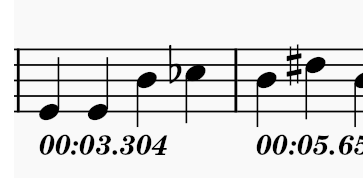
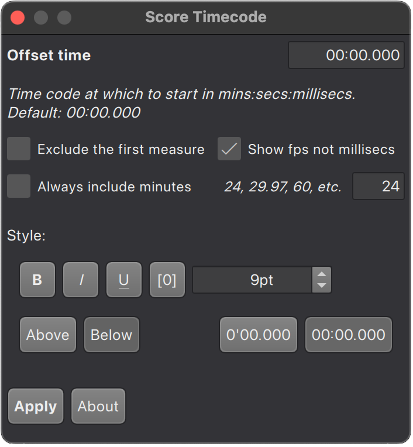

# Score Timecode

Score Timecode is a plugin for MuseScore Studio (v4.4) that adds the elapsed time in seconds to each measure. 
It's as simple as selecting an entire staff, or just a number of bars in the staff, and clicking "Apply".  Score Timecode will then add the elapsed time in minutes, seconds and milliseconds to each bar.  You can even add an offset time, and select various formatting options to make the text look just the way you want it to. 

All tempo changes are taken into account, so the timecode should be as accurate as possible. 

Usage
-----

**Offset time**\
Enter the timecode for the first measure, in minutes, seconds and milliseconds. Only numbers may be entered, and the correct formatting will be forced by the plugin. A maximum of 99 minutes can be entered.\
Note that for milliseconds, trailing zeros are added if required, so entering "00:00.5" will be interpretted as "00:00:500". 

**Exclude the first measure**\
Check this box to _not_ write the timecode to the first measure selected. In most situations this will be 0.000, and superfluous. 

**Always include minutes**\
Check this box to _always_ include the minutes component when writing the timecode.\
- When this box is _unchecked_ (default) the minutes will only be included once it is required, and the seconds will be written using one or two digits as required.\
- When this box _checked_ the minutes will always be included in the timecode (even when 0), and the  seconds will always be written using two digits. 

**Style**\
Set various text style parameters for the timecode. Bold, Italic, Undescore and Square border may be combined as required. 
- **B** - Make the timecode text appear in **bold**
- **_I_** - Make the timecode text appear in _italic_
- **<ins>U</ins>** - Make the timecode text appear as <ins>underlined</ins> 
- **[0]** - Make the timecode text appear with a square border
- **Size** - Select the point size to use. The default is 9, and this can range from 1 to 99. 
- **Above** / **Below** (default) - Select whether to write the timecode above or below the selected staff. 
- **0'00.000** / **0:00.000** (default) - Select the style of timecode to use. 

**Apply**\
Write the timecodes to the selected measures.

**About**\
See the About dialog. 
 
Installation
-------------
To install the plugin:
1. Download the latest version from the releases. 
1. Unzip the file contents into a separate folder. This will typically be "ScoreTimecode-xxx" for some version.
1. Move the folder into your MuseScore Plugins folder, which can be found here (for MuseScore 4)
   * Windows: %HOMEPATH%\Documents\MuseScore4\Plugins
   * Mac: ~/Documents/MuseScore4/Plugins
   * Linux: ~/Documents/MuseScore4/Plugins
1. Launch MuseScore
1. Select the menu item Plugins > Plugin Manager...
1. Enable the "Score Timecode" plugin
   
To use the plugin:
1. Select the menu item Plugins > Score Timecode.  
1. Select any number of bars in the staff where you want the time code to be written.
1. Follow the descriptions above for the various options, and click "Apply".
   
Release History
-------------
**v1.0** - 24/4/2025 - Initial Release

